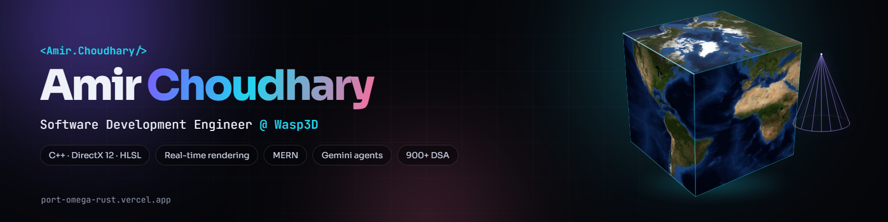

  

  
  
  
  

  

## Hi, I'm Amir 👋

I'm a **Software Development Engineer at Wasp3D** (Noida, India), working on the rendering side of a real-time graphics engine — planar reflections, water simulation, HLSL shaders and GPU resource management in **C++ / DirectX 12**. Before that I shipped full-stack **MERN** products with JWT / OAuth auth and **Gemini** integrations. Finishing a B.Tech in Computer Science (AI & ML) at G.L. Bajaj, class of 2026.

- 🔭 **Right now:** packing render targets, hunting shader bugs, and building small Gemini agents on the side
- 🧠 **Core:** C++ · DirectX 12 · HLSL · JavaScript / TypeScript · React · Node.js · MongoDB · Python
- 🏆 **Top 3** at Adobe Emerge 2025 (IIT Delhi) · **Top 6** at Hack For Impact 2025 (IIIT Delhi) · **900+** DSA problems solved
- 📫 Open to SDE, graphics and full-stack roles — **amirchoudharyb03@gmail.com**

## Featured work

| Project | What it is | Stack |
|---|---|---|
| **[AshGuard](https://github.com/Amirchoudhary09/ASHGUARD)** · [live](https://enchantress-ashguard.vercel.app/) | Women-safety & travel assistant: 1-tap SOS, live location, K-Means safe routes, Gemini chatbot — 200+ users, Top 3 at Adobe Emerge | JavaScript · Python · Gemini · ML |
| **[Lost & Found](https://github.com/Amirchoudhary09/lost-and-find)** · [live](https://lost-and-find-ytbs.vercel.app/) | Community platform with JWT + Google OAuth, image uploads, location tagging and item matching | MERN |
| **[Portfolio](https://github.com/Amirchoudhary09/port)** · [live](https://port-omega-rust.vercel.app/) | Slide-deck portfolio with a live WebGL water-reflection sketch, an interactive terminal and no build step | Vanilla JS · three.js · WebGL |
| **[DirectX 12 Procedural Renderer](https://github.com/Amirchoudhary09/Cube_by_dx12)** · [cone variant](https://github.com/Amirchoudhary09/Cone_through_DX12) | Procedural textured cube and cone through a hand-rolled DX12 pipeline — buffers, root signature, barriers, fences, HLSL lighting | C++ · DirectX 12 · Win32 · HLSL |
| **[Gemini Agents](https://github.com/Amirchoudhary09/gen-ai)** | A function-calling assistant (crypto, weather, math tools) and a terminal coding agent that plans → executes → validates shell commands | Node.js · Gemini 2.5 Flash |
| **[AI Trip Planner](https://github.com/Amirchoudhary09/Travel-Itinerary-Planner-)** · [live](https://enchantress-trips-planner.vercel.app/) | Gemini-generated day-by-day itineraries with hotels, meals and safety notes | React · Vite · Firebase · Gemini |
| **[House Price Prediction](https://github.com/Amirchoudhary09/house_predict)** | scikit-learn regression model served by Flask, with a React frontend | Python · Flask · React |

## Tech stack

**Graphics & systems**  

**Languages**  

**Web**  

**AI**  

**Tools**  

## Experience

**Software Development Engineer — Wasp3D**, Noida · April 2026 – present
- Cut the planar-reflection pipeline from 2 render targets to 1 through render-target packing — **~50% less GPU bandwidth** at the same visual quality.
- Built real-time water: ripple simulation, flow-map animation, distortion and planar reflections.
- Wrote and debugged HLSL vertex / pixel shaders across lighting, materials and texture sampling; optimised DirectX 9/12 render targets, textures and GPU resource management.

**Software Development Engineer Intern — Bluestocks Fintech**, remote · March – May 2025
- Responsive services page in React + Tailwind with a modular component architecture (**20% faster page loads**); CRUD REST APIs on Express + MongoDB.
- API testing in Postman with proper error handling and edge-case validation; Agile sprints with bi-weekly stakeholder demos.

## Achievements & certifications

- 🥉 **Top 3** — Adobe Emerge Hackathon 2025, IIT Delhi (national)
- 🏅 **Top 6** — Hack For Impact 2025, IIIT Delhi
- 🏅 **Top 10** — HackSprint Hackathon 2024, GDG GL Bajaj
- 🌟 AshGuard selected for the Bharat Shiksha 3-day expo
- 🧠 **900+** DSA problems on [LeetCode](https://leetcode.com/u/AMIR09/) (max rating 1600) and [GeeksforGeeks](https://www.geeksforgeeks.org/profile/amirchoudharyb09)
- 🎓 Google for Developers — virtual internship · Cisco — CCNA / Python · HackSprint coding competition (GDG GL Bajaj)

## GitHub

  
  

  

  

  <picture>
    <source media="(prefers-color-scheme: dark)" srcset="https://raw.githubusercontent.com/Amirchoudhary09/Amirchoudhary09/output/github-snake-dark.svg">
    
  </picture>

## Let's connect

  
  
  
  
  

