  

  
  
  
  

  

## 👋 Hi, I'm Amir

I'm a **Software Development Engineer at Wasp3D** (Noida, India), working on the rendering side of a real-time graphics engine — planar reflections, water simulation, HLSL shaders and GPU resource management in **C++ / DirectX 12**. Before that I shipped full-stack **MERN** products with JWT / OAuth auth and **Gemini** integrations. Finishing a B.Tech in Computer Science (AI & ML) at G.L. Bajaj, class of 2026.

- 🔭 **Right now:** packing render targets, hunting shader bugs, and building small Gemini agents on the side
- 🧠 **Core:** C++ · DirectX 12 · HLSL · JavaScript / TypeScript · React · Node.js · MongoDB · Python
- 🏆 **Top 3** at Adobe Emerge 2025 (IIT Delhi) · **Top 6** at Hack For Impact 2025 (IIIT Delhi) · **900+** DSA problems solved
- 📫 Open to SDE, graphics and full-stack roles — **amirchoudharyb03@gmail.com**

## 🚀 Featured work

<table>
  <tr>
    <td width="50%" valign="top">
      
      <h3>AshGuard — Women Safety &amp; Travel Assistant</h3>
      
1-tap SOS (fake call, live recording, guardian alert, siren), live location, a <b>K-Means safe-route finder</b> and a Gemini chatbot. <b>200+ users</b> · Top 3 at Adobe Emerge 2025.

      
<code>JavaScript</code> <code>Python</code> <code>Gemini</code> <code>ML</code> &nbsp;·&nbsp; <a href="https://enchantress-ashguard.vercel.app/">Live</a> · <a href="https://github.com/Amirchoudhary09/ASHGUARD">Code</a>

    </td>
    <td width="50%" valign="top">
      
      <h3>Lost &amp; Found Community Platform</h3>
      
Post lost or found items with photos and location; <b>JWT + Google OAuth</b>, real-time filtering and a matching algorithm that suggests likely pairs. Query tuning made search <b>40% faster</b>.

      
<code>React</code> <code>Node</code> <code>Express</code> <code>MongoDB</code> &nbsp;·&nbsp; <a href="https://lost-and-find-ytbs.vercel.app/">Live</a> · <a href="https://github.com/Amirchoudhary09/lost-and-find">Code</a>

    </td>
  </tr>
  <tr>
    <td width="50%" valign="top">
      
      <h3>Portfolio — with a live WebGL water sketch</h3>
      
Slide-deck site with <b>no build step</b>: a WebGL water shader (waves + cursor ripples → normals → Fresnel reflection) that mirrors my engine work, a three.js backdrop and an interactive terminal.

      
<code>Vanilla JS</code> <code>WebGL</code> <code>three.js</code> &nbsp;·&nbsp; <a href="https://port-omega-rust.vercel.app/">Live</a> · <a href="https://github.com/Amirchoudhary09/port">Code</a>

    </td>
    <td width="50%" valign="top">
      
      <h3>DirectX 12 Procedural Mesh Renderer</h3>
      
Procedural textured <b>cube and cone</b> through a hand-rolled DX12 pipeline — vertex/index buffers, root signature, constant buffer, resource barriers, GPU fence — with Lambert lighting in HLSL.

      
<code>C++</code> <code>DirectX 12</code> <code>Win32</code> <code>HLSL</code> &nbsp;·&nbsp; <a href="https://github.com/Amirchoudhary09/Cube_by_dx12">Cube</a> · <a href="https://github.com/Amirchoudhary09/Cone_through_DX12">Cone</a>

    </td>
  </tr>
  <tr>
    <td width="50%" valign="top">
      
      <h3>Gemini Function-Calling Agents</h3>
      
A tool-using assistant (math, live crypto prices, weather) and a <b>terminal coding agent</b> that plans → executes → validates shell commands to scaffold a whole frontend project.

      
<code>Node.js</code> <code>Gemini 2.5 Flash</code> <code>function calling</code> &nbsp;·&nbsp; <a href="https://github.com/Amirchoudhary09/gen-ai">Code</a> · <a href="https://github.com/Amirchoudhary09/dsa_instructor">Chatbot variant</a>

    </td>
    <td width="50%" valign="top">
      
      <h3>AI Trip Planner</h3>
      
Tell it where, how long and your budget — Gemini writes a <b>day-by-day itinerary</b> with hotels, meals and safety notes; trips are saved to your account.

      
<code>React</code> <code>Vite</code> <code>Firebase</code> <code>Gemini</code> &nbsp;·&nbsp; <a href="https://enchantress-trips-planner.vercel.app/">Live</a> · <a href="https://github.com/Amirchoudhary09/Travel-Itinerary-Planner-">Code</a>

    </td>
  </tr>
</table>

Also: <a href="https://github.com/Amirchoudhary09/house_predict">House Price Prediction</a> (scikit-learn model behind a Flask API and a React UI) · <a href="https://github.com/Amirchoudhary09/Prayer_Time">Prayer Times PWA</a> · <a href="https://github.com/Amirchoudhary09/human-machine">Insurance claim decision system</a>

## 🧰 Tech stack

  

  
  
  
  
  
  

## 💼 Experience

**Software Development Engineer — Wasp3D**, Noida · April 2026 – present
- Cut the planar-reflection pipeline from 2 render targets to 1 through render-target packing — **~50% less GPU bandwidth** at the same visual quality.
- Built real-time water: ripple simulation, flow-map animation, distortion and planar reflections.
- Wrote and debugged HLSL vertex / pixel shaders across lighting, materials and texture sampling; optimised DirectX 9/12 render targets, textures and GPU resource management.

**Software Development Engineer Intern — Bluestocks Fintech**, remote · March – May 2025
- Responsive services page in React + Tailwind with a modular component architecture (**20% faster page loads**); CRUD REST APIs on Express + MongoDB.
- API testing in Postman with proper error handling and edge-case validation; Agile sprints with bi-weekly stakeholder demos.

## 🏆 Achievements & certifications

- 🥉 **Top 3** — Adobe Emerge Hackathon 2025, IIT Delhi (national)
- 🏅 **Top 6** — Hack For Impact 2025, IIIT Delhi
- 🏅 **Top 10** — HackSprint Hackathon 2024, GDG GL Bajaj
- 🌟 AshGuard selected for the Bharat Shiksha 3-day expo
- 🧠 **900+** DSA problems on [LeetCode](https://leetcode.com/u/AMIR09/) (max rating 1600) and [GeeksforGeeks](https://www.geeksforgeeks.org/profile/amirchoudharyb09)
- 🎓 Google for Developers — virtual internship · Cisco — CCNA / Python · HackSprint coding competition (GDG GL Bajaj)

## 📊 GitHub

<!-- github-profile-summary-cards is used instead of github-readme-stats: the public
     readme-stats instance is rate-limited most of the day and the activity-graph one is offline -->

  
  

  

  <picture>
    <source media="(prefers-color-scheme: dark)" srcset="https://raw.githubusercontent.com/Amirchoudhary09/Amirchoudhary09/output/github-snake-dark.svg">
    
  </picture>

## 🤝 Let's connect

  
  
  
  
  

  

